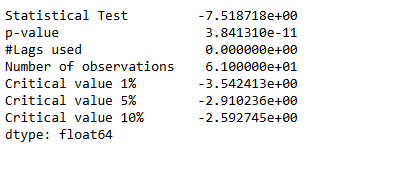

# Managing Demand Surge During a Viral Campaign

# Table of Contents
- [Introduction](#Introduction)
- [Objective](#Objective)
- [Data Source](#Data-Source)
- [Analysis](#Analysis)
  - [Demand Forecasting](#Demand-Forecasting)
- [Conclusion](#Conclusion)

# Introduction
In a fast-paced retail environment, a sudden surge in demand can disrupt even the most carefully planned supply chains. GreenMart Supplies faced such a challenge when a newly launched marketing campaign for their best-selling product, Product P1, went viral overnight. Promising "next-day delivery, always in stock," the campaign drew unprecedented attention, causing sales to spike by 200% within 24 hours.
The unexpected demand put immense pressure on inventory levels, creating the risk of stockouts and unfulfilled orders that could tarnish the company's reputation. The challenge was clear: GreenMart needed an immediate, data-driven solution to **forecast demand, replenish inventory, and ensure seamless order fulfillment** during this critical period.

# Objective
This project delves into how advanced forecasting techniques, safety stock calculations, and inventory optimization strategies can transform chaotic scenarios into well-managed supply chain operations, even under extreme pressure.

# Data Source
The data is from Statso [Here is the link]([https://github.com/your-repo-link](https://statso.io/inventory-optimization-case-study/))
There are 5 columns:
- index
- Date (Date)
- Product_ID (String)
- Demand (Integer)
- Inventory (Integer)
in terms of forecasting demand we just need the date as index and the demand column.
However for calculating optimized inventory (safety stock calculation etc.), we need to create some assumptions.

# Analysis
I separate the analysis into 2 part: demand forecasting and inventory optimisation.

## Demand Forecasting
Let's start with importing some modules for visualisation and time series forecast

1. Data Exploring
  ```python
  import pandas as pd # Pandas is a Python library used for working with data sets. It has functions for analyzing, cleaning, exploring, and manipulating data.
  import numpy as np # NumPy arrays facilitate advanced mathematical and other types of operations on large numbers of data
  import plotly.express as px # Plotly express is a high-level data visualization package that allows you to create interactive plots with very little code
  from statsmodels.graphics.tsaplots import plot_acf, plot_pacf
  # plot_acf: Plots lags on the horizontal axis and correlations on the vertical axis 
  # plot_pacf: Plots lags on the horizontal axis and correlations on the vertical axis. It also allows you to specify the calculation method, such as Yule Walker, Levinson-Durbin recursion, or regression of time series on lags
  import matplotlib.pyplot as plt # Matplotlib allows you to generate plots, histograms, bar charts, scatter plots, etc
  from statsmodels.tsa.stattools import adfuller
  from statsmodels.tsa.statespace.sarimax import SARIMAX
  from statsmodels.tsa.arima.model import ARIMA
  from sklearn.metrics import mean_squared_error
  
  # Exporing the data
  df = pd.read_csv("demand_inventory.csv")
  df.info()
  df['Date'] = pd.to_datetime(df['Date'],format='%Y/%m/%d')
  # we have the demand from 2023-06 to 2023-08 (2 months)
  
  ```
  

2. Data Cleaning
     Only keep the column date and demand to fit in the forecast model
     ```python
     df_demand = df[['Date','Demand']]
     df_demand = df_demand.set_index('Date')
     df_demand.info()
     ```
    

3. Data Visualisation
    Visualise the data and see if we can identify a pattern
    ```python
    plt.figure(figsize=(20,5))
    plt.plot(df_demand)
    ```

4. Data Validation
    Check if the data is suitable for an ARIMA model by determining whether it is stationary or not.
    
    ```python
    # import the ADF (Augmented Dickey-Fuller) test
    # H0: The Time Series is non-stationary
    # H1: The Time Series is stationary (which ARIMA models work best with)
    # If p value < 0.05 then reject H0
    
    from statsmodels.tsa.stattools import adfuller
    
    # create a function that returns the necessary metrics to test stationarity
    def test_stationarity(timeseries):
        dftest_initial = adfuller(timeseries)
        dfoutput_initial = pd.Series(dftest_initial[0:4], 
              index=['Statistical Test', 
                     'p-value', 
                     '#Lags used', 
                     'Number of observations'
                     ])
        for key, value in dftest_initial[4].items():
            dfoutput_initial['Critical value ' + key] = value
        print(dfoutput_initial)
        print('\n')
    test_stationarity(df_demand)
    ```
    The original timeseries is stationary.
    

5. ARIMA model
  - determine p & q value
    p = last lag where the PACF value is out of the significance band
    q = last lag where the ACF value is out of the significance band (displayed by the confidence interval
    ```python
    # ref: https://www.linkedin.com/pulse/time-series-episode-1-how-select-correct-sarima-vasilis-kalyvas-jqcjf/
    
    differenced_series = df_demand
    
    fig,axes = plt.subplots(1,2,figsize=(12,4))
    plot_acf(differenced_series,ax=axes[0])
    plot_pacf(differenced_series,ax=axes[1])
    plt.show()
    ```
    p and q are in the blue area. Let's go back the testing and see if we can use differenced df_demand
    
    
    ```python
    test_stationarity(df_demand.diff().dropna())
    ```
    The first-order differenced (lagged) demand is stationary as well
    

    ```python
    differenced_series = df_demand.diff().dropna()
    
    fig,axes = plt.subplots(1,2,figsize=(12,4))
    plot_acf(differenced_series,ax=axes[0])
    plot_pacf(differenced_series,ax=axes[1])
    plt.show()
    
    ```
    Now we get **q = 1** (PACF plot), **d =1** (as we differenced the Time Series), and **q = 1** (ACF plot)
    

