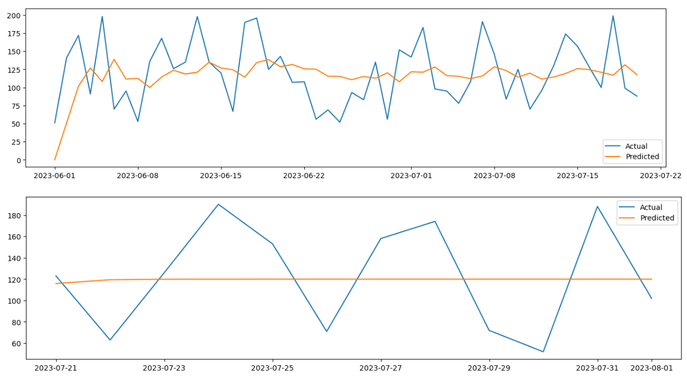
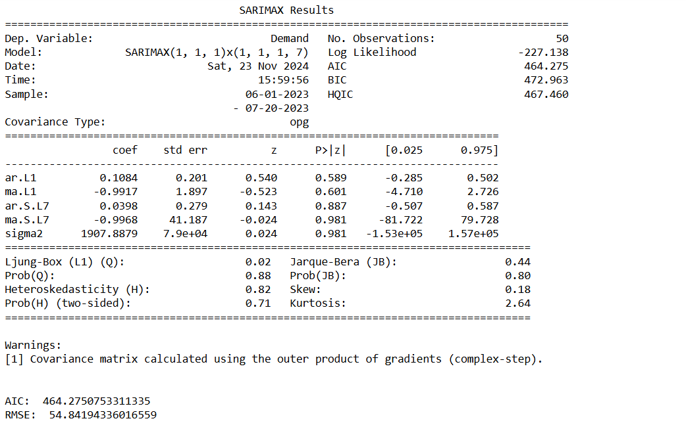
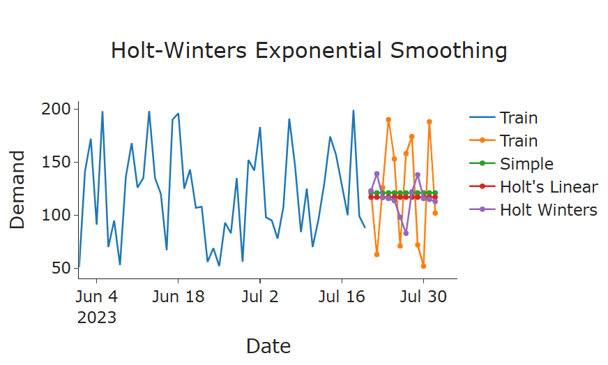
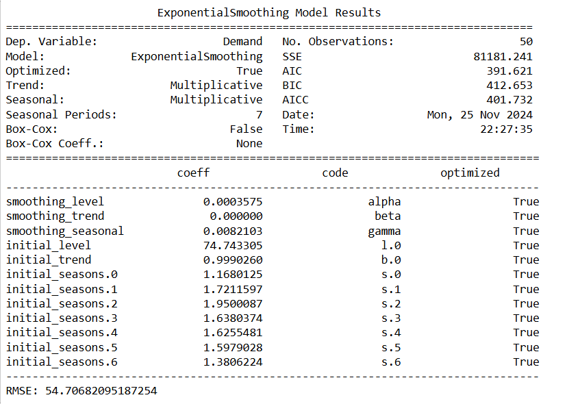

# Managing Demand Surge During a Viral Campaign

# Table of Contents
- [Introduction](#Introduction)
- [Objective](#Objective)
- [Data Source](#Data-Source)
- [Analysis](#Analysis)
  - [Demand Forecasting](#Demand-Forecasting)
- [Conclusion](#Conclusion)

# Introduction
In a fast-paced retail environment, a sudden surge in demand can disrupt even the most carefully planned supply chains. GreenMart Supplies faced such a challenge when a newly launched marketing campaign for their best-selling product, Product P1, went viral overnight. Promising "next-day delivery, always in stock," the campaign drew unprecedented attention, causing sales to spike by 200% within 24 hours.
The unexpected demand put immense pressure on inventory levels, creating the risk of stockouts and unfulfilled orders that could tarnish the company's reputation. The challenge was clear: GreenMart needed an immediate, data-driven solution to **forecast demand, replenish inventory, and ensure seamless order fulfillment** during this critical period.

# Objective
This project delves into how advanced forecasting techniques, safety stock calculations, and inventory optimization strategies can transform chaotic scenarios into well-managed supply chain operations, even under extreme pressure.

# Data Source
The data is from Statso [Here is the link]([https://github.com/your-repo-link](https://statso.io/inventory-optimization-case-study/))
There are 5 columns:
- index
- Date (Date)
- Product_ID (String)
- Demand (Integer)
- Inventory (Integer)

in terms of forecasting demand we just need the date as index and the demand column.
However for calculating optimized inventory (safety stock calculation etc.), we need to create some assumptions.

# Analysis
I separate the analysis into 2 part: demand forecasting and inventory optimisation.

## Demand Forecasting
Let's start with importing some modules for visualisation and time series forecast

1. Data Exploring
   
   ```python
   import pandas as pd # Pandas is a Python library used for working with data sets. It has functions for analyzing, cleaning, exploring, and manipulating data.
   import numpy as np # NumPy arrays facilitate advanced mathematical and other types of operations on large numbers of data
   import plotly.express as px # Plotly express is a high-level data visualization package that allows you to create interactive plots with very little code
   from statsmodels.graphics.tsaplots import plot_acf, plot_pacf
   # plot_acf: Plots lags on the horizontal axis and correlations on the vertical axis 
   # plot_pacf: Plots lags on the horizontal axis and correlations on the vertical axis. It also allows you to specify the calculation method, such as Yule Walker, Levinson-Durbin recursion, or regression of time series on lags
   import matplotlib.pyplot as plt # Matplotlib allows you to generate plots, histograms, bar charts, scatter plots, etc
   from statsmodels.tsa.stattools import adfuller
   from statsmodels.tsa.statespace.sarimax import SARIMAX
   from statsmodels.tsa.arima.model import ARIMA
   from sklearn.metrics import mean_squared_error
   # Exporing the data
   df = pd.read_csv("demand_inventory.csv")
   df.info()
   df['Date'] = pd.to_datetime(df['Date'],format='%Y/%m/%d')
   # we have the demand from 2023-06 to 2023-08 (2 months)
   ```
  
    

2. Data Cleaning

   Only keep the column date and demand to fit in the forecast model
   ```python
   df_demand = df[['Date','Demand']]
   df_demand = df_demand.set_index('Date')
   df_demand.info()
   ```
   

4. Data Visualisation

   Visualise the data and see if we can identify a pattern
   ```python
   plt.figure(figsize=(20,5))
   plt.plot(df_demand)
   ```
   

5. Data Validation

  Check if the data is suitable for an ARIMA model by determining whether it is stationary or not.
  ```python
  # import the ADF (Augmented Dickey-Fuller) test
  # H0: The Time Series is non-stationary
  # H1: The Time Series is stationary (which ARIMA models work best with)
  # If p value < 0.05 then reject H0
      
  from statsmodels.tsa.stattools import adfuller
  
  # create a function that returns the necessary metrics to test stationarity
  def test_stationarity(timeseries):
  dftest_initial = adfuller(timeseries)
  dfoutput_initial = pd.Series(dftest_initial[0:4], 
  index=['Statistical Test', 
                       'p-value', 
                       '#Lags used', 
                       'Number of observations'
                       ])
  for key, value in dftest_initial[4].items():
  dfoutput_initial['Critical value ' + key] = value
  print(dfoutput_initial)
  print('\n')
  test_stationarity(df_demand)
  ```
  The original timeseries is stationary.
  

6. ARIMA model
   
- determine p & q value
    p = last lag where the PACF value is out of the significance band
    q = last lag where the ACF value is out of the significance band (displayed by the confidence interval)
    ```python
    # ref: https://www.linkedin.com/pulse/time-series-episode-1-how-select-correct-sarima-vasilis-kalyvas-jqcjf/
    
    differenced_series = df_demand
    
    fig,axes = plt.subplots(1,2,figsize=(12,4))
    plot_acf(differenced_series,ax=axes[0])
    plot_pacf(differenced_series,ax=axes[1])
    plt.show()
    ```
    p and q are in the blue area. Let's go back the testing and see if we can use differenced df_demand
    
    
    ```python
    test_stationarity(df_demand.diff().dropna())
    ```
    The first-order differenced (lagged) demand is stationary as well
    

    ```python
    differenced_series = df_demand.diff().dropna()
    
    fig,axes = plt.subplots(1,2,figsize=(12,4))
    plot_acf(differenced_series,ax=axes[0])
    plot_pacf(differenced_series,ax=axes[1])
    plt.show()
    
    ```
    Now we get **q = 1** (PACF plot), **d =1** (as we differenced the Time Series), and **q = 1** (ACF plot)
    

- training

  ```python
  testing_timeframe = 5
  train1 = df_demand.iloc[:-int(len(df_demand)*0.2)]
  test1  = df_demand.iloc[-int(len(df_demand)*0.2):]
  print('training set (past data): ', len(train1))
  print('test set (days to be forecasted ahead): ', len(test1))
  ```
  

- ARIMA result

  ```python
  # import the required modules
  from statsmodels.tsa.arima.model import ARIMA
  from statsmodels.tsa.statespace.sarimax import SARIMAX
  from sklearn.metrics import mean_squared_error
  
  # create and fit the model
  model_fit = ARIMA(train1,  
                    order = (2,1,1)
                  ).fit()
  print(model_fit.summary())
  print('\n')
  #####################################################################################
  
  # create forecasts on training set (to evaluate how the model behaves to known-training data)
  forecasts_on_train = model_fit.predict()
  # create forecasts on test set (to evaluate how the model behaves to unknown-test data)
  forecasts_on_test  = model_fit.forecast(len(test1))
  # calculate the root mean squared error on the test set
  RMSE = np.sqrt(mean_squared_error(test1['Demand'], forecasts_on_test))
  # print the AIC and RMSE 
  print('AIC: ' , model_fit.aic)
  print('RMSE: ', RMSE)
  
  #####################################################################################
  
  # plot the train and test daat against their corresponding forecasts
  # on train data
  plt.figure(figsize=(16,4))
  plt.plot(train1['Demand'], label="Actual")
  plt.plot(forecasts_on_train, label="Predicted")
  plt.legend()
  # on test data
  plt.figure(figsize=(16,4))
  plt.plot(test1['Demand'], label="Actual")
  plt.plot(forecasts_on_test, label="Predicted")
  plt.legend()
  ```
  when order = (2,1,1), we get the optimised RMSE
  The second graph shows that we need to add seaonality.
  
  

  

  ```python
  # import the required modules
  from statsmodels.tsa.arima.model import ARIMA
  from statsmodels.tsa.statespace.sarimax import SARIMAX
  from sklearn.metrics import mean_squared_error
  
  # D=1 if the series has a stable seasonal pattern over time
  # S = ACG lag with the highest value (typically at a high lag), often it is 4 for quarterly data or 12 for monthly data. In this case, S=2
  # P>=1 if the ACF is greater than 0 at S=2, else P= 0
  # Q>=1 if the ACF is less than 0 at S=2, else Q= 0
  # therfore P = 0 and Q = 2
  
  # create and fit the model
  model_fit = SARIMAX(train1,order=(2,1,1),seasonal_order=(0,1,2,2)).fit()
  print(model_fit.summary())
  print('\n')
  #####################################################################################
  
  # create forecasts on training set (to evaluate how the model behaves to known-training data)
  forecasts_on_train = model_fit.predict()
  # create forecasts on test set (to evaluate how the model behaves to unknown-test data)
  forecasts_on_test  = model_fit.forecast(len(test1))
  # calculate the root mean squared error on the test set
  RMSE = np.sqrt(mean_squared_error(test1['Demand'], forecasts_on_test))
  # print the AIC and RMSE 
  print('AIC: ' , model_fit.aic)
  print('RMSE: ', RMSE)
  
  #####################################################################################
  
  # plot the train and test daat against their corresponding forecasts
  # on train data
  plt.figure(figsize=(16,4))
  plt.plot(train1['Demand'], label="Actual")
  plt.plot(forecasts_on_train, label="Predicted")
  plt.legend()
  # on test data
  plt.figure(figsize=(16,4))
  plt.plot(test1['Demand'], label="Actual")
  plt.plot(forecasts_on_test, label="Predicted")
  plt.legend()
  ```

  

  

  ```python
  # Create the diagnostics plot to do the final validation.
  model_fit.plot_diagnostics(figsize=(14,7))
  plt.show()
  ```

  1. Standardized residual: There are no patterns in the residuals.
  2. Histogram plus kde estimate: The KDE curve should be very similar to the normal distribution.
  3. Normal Q-Q: Most of the data points should lie on the straight line,
  4. Correlogram: 95% of correlations for lag greater than one should not be significant.  

  

  ```python
  # forecast for the next 10 days
  order = (2, 1, 1)
  seasonal_order = (0, 1, 1, 2) #2 because the data contains a time period of 2 months only
  model = SARIMAX(df_demand, order=order, seasonal_order=seasonal_order)
  model_fit = model.fit(disp=False)
  
  future_steps = 10
  predictions = model_fit.predict(len(df_demand), len(df_demand) + future_steps - 1)
  predictions = predictions.astype(int)
  print(predictions)
  ```
  
  

  ```python
  import math

  # Create date indices for the future predictions
  future_dates = pd.date_range(start=df_demand.index[-1] + pd.DateOffset(days=1), periods=future_steps, freq='D')
  
  # Create a pandas Series with the predicted values and date indices
  forecasted_demand = pd.Series(predictions, index=future_dates)
  
  # Initial inventory level
  initial_inventory = 1000
  
  # Lead time (number of days it takes to replenish inventory) 
  lead_time = 100 # production + shipping from APAC to EMEA
  
  # Service level (probability of not stocking out)
  service_level = 0.95
  
  # Calculate the optimal order quantity using the Newsvendor formula
  z = np.abs(np.percentile(forecasted_demand, 100 * (1 - service_level)))
  order_quantity = np.ceil(forecasted_demand.mean() + z).astype(int)
  
  # Calculate the reorder point
  reorder_point = forecasted_demand.mean() * lead_time + z
  
  # Calculate the optimal safety stock
  safety_stock = reorder_point - forecasted_demand.mean() * lead_time
  
  # Calculate the total cost (holding cost + stockout cost)
  holding_cost = 0.1  # it's different for every business, 0.1 is an example
  stockout_cost = 10  # # it's different for every business, 10 is an example
  total_holding_cost = holding_cost * (initial_inventory + 0.5 * order_quantity)
  total_stockout_cost = stockout_cost * np.maximum(0, forecasted_demand.mean() * lead_time - initial_inventory)
  
  # Calculate the total cost
  total_cost = total_holding_cost + total_stockout_cost
  
  # Calculate EOQ = [(2*S*D)/H]^(1/2)
  EOQ = math.sqrt((2*stockout_cost*forecasted_demand.mean())/holding_cost)
  
  
  print("Optimal Order Quantity:", order_quantity)
  print("Reorder Point:", reorder_point)
  print("Safety Stock:", safety_stock)
  print("Total Cost:", total_cost)
  print("EOQ:",EOQ)
  ```

  
